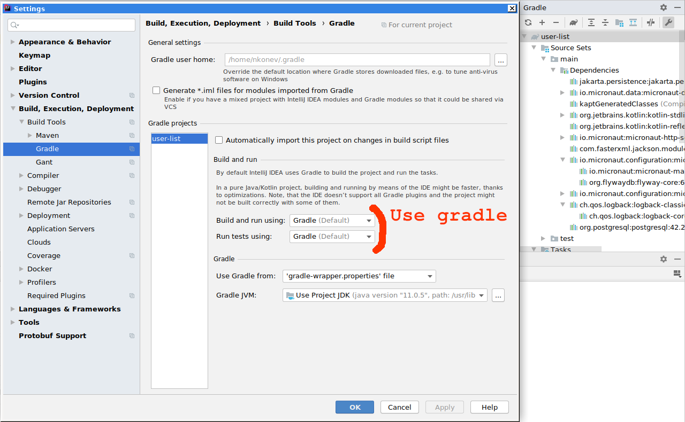
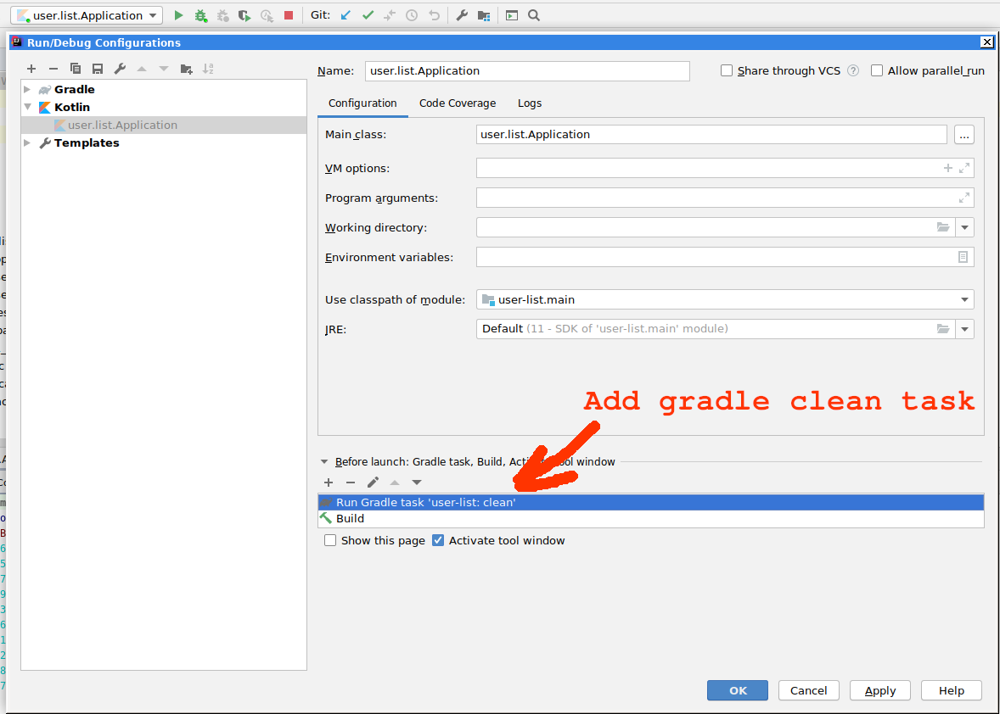

```bash
mn create-app -l kotlin -f flyway,jdbc-hikari,kotlintest,logback,http-server user-list
```

rm dependency micronaut-client which uses reactive-java

https://guides.micronaut.io/micronaut-spa-react/guide/

# Configure IDE
https://docs.micronaut.io/latest/guide/index.html#kaptintellij




# Test
```bash
curl -v -H "Content-Type: application/json" -X POST -d '{"name":"Nikita", "surname":"Konev"}'  http://localhost:8080/user
curl -v -H "Content-Type: application/json" -X PATCH -d '{"id": 1, "name":"Nikitas", "surname":"Konev"}'  http://localhost:8080/user
curl -v -X DELETE  http://localhost:8080/user/1
curl -v   http://localhost:8080/user/2
```